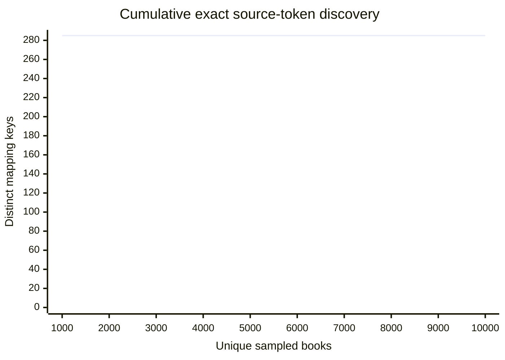
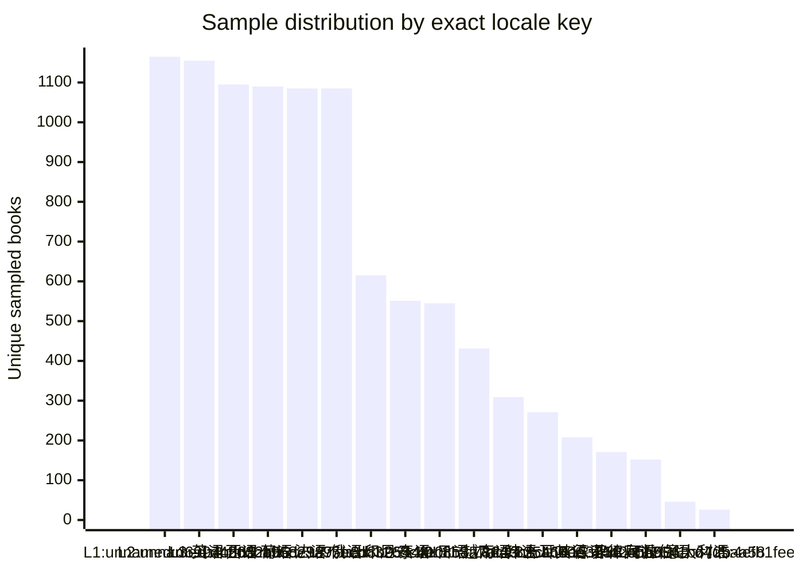

# P2-06.5 Lane B · B1 Source Taxonomy Sampling Report

## Conclusion

Run `2026-08-15-changdu-real-b1-v2` contains **10000** exact unique sampled books and **285** distinct `source scope + locale key + exact raw token` keys.
Taxonomy coverage is **NOT_ESTIMABLE_NO_DENOMINATOR**: the source exposes no authoritative complete token denominator, so this report does not invent a coverage percentage.

## Fact baseline

- Generated at: `2026-08-15T12:07:58.774Z`
- Target unique books: 10000
- Actual unique books: 10000
- Exact source-token keys: 285
- Empirical token coverage (final sample / candidate pool): 1.000000
- Unextractable/ambiguous raw list members: 0
- Discovery assessment: `TAXONOMY_DISCOVERY_NOT_SATURATED`

## Operational QA

The authoritative raw facts passed semantic round-trip verification, but the frozen request-budget QA failed. This run remains `PARTIAL` and taxonomy discovery remains `TAXONOMY_DISCOVERY_NOT_SATURATED`; no additional requests were made.
- Raw stop reason: `PLANNED_PAGES_COMPLETE`
- Verification failures: `request-attempts.jsonl:start_interval`

## Taxonomy discovery curve



## Language / locale distribution

The chart uses the exact raw-language scope: JSON type + JSON value + raw languageName. Site locale remains null; this report does not guess a locale.



| Chart label | language JSON type | language JSON value | languageName state/raw | raw-language scope SHA-256 | books |
| --- | --- | --- | --- | --- | ---: |
| L1 | `number` | `20` | `null` | `d6997bdd584a56511610348c3092b89765248a523c467254d44675b722a606c0` | 1165 |
| L2 | `number` | `19` | `null` | `d42632bde984f63fec0efea2ee95b76ce2adceb801a3dc9a920dd00c1a8a184b` | 1155 |
| L3 | `number` | `3` | string / `英语` | `5cdba55dc72657ea24a8cca1f65f8b5b365fd7432e645cf29f4700d57484738b` | 1095 |
| L4 | `number` | `4` | string / `西语` | `1968e98701fe0acc6ada9913447690ab729c8d66fe208c0059cfe2a39159eba5` | 1090 |
| L5 | `number` | `5` | string / `葡语` | `23a95ecb1346e38786456b9d60adb301d8eeb638471b498f937c8586725d2a6a` | 1085 |
| L6 | `number` | `6` | string / `法语` | `7bcdb326c562ad66de03d1d2ca2db3b8e68930f93f38616ff6ded4a28166058a` | 1085 |
| L7 | `number` | `7` | string / `俄语` | `8b0544f0f53694353c98693770828f16756b98618ab66eb580c625b03dd7d0e9` | 615 |
| L8 | `number` | `11` | string / `印尼` | `5c4ec8583eca7b099391c70159d8d37fb0afc4962779153098446efd31d0fe61` | 551 |
| L9 | `number` | `12` | string / `泰语` | `0cb3a7ac259d32d3ef2819bf2409d6ee510840d7a23af8d373e5dda36245f3b7` | 545 |
| L10 | `number` | `9` | string / `日语` | `7864bb8c027a55f174818ce4fe00c32539eb7e8a84ae2284fd50e8a548d48b1f` | 431 |
| L11 | `number` | `13` | string / `越南语` | `835ac60e7ebb74d2bd327ada65eaac883449e94af34e1ad72bc9bcc32940e5bd` | 309 |
| L12 | `number` | `14` | string / `韩语` | `468ee375913901932d8cd006a58ac2c8e055124f1981dfb992959a369a0ea4a9` | 271 |
| L13 | `number` | `22` | string / `土耳其语` | `4442cbb90023ded021fc992ffbf03853fca4c95772f197b71312d45306ef1abe` | 208 |
| L14 | `number` | `16` | string / `德语` | `b0e5b50615684e6b87d94bfaf94e4a42f2dc074d6fe9c04728194a6cf6d2b50a` | 171 |
| L15 | `number` | `15` | string / `菲律宾语` | `641b672b29a3ecfd05bce23eef09c6624ab5449b84028f710933eda58bb982f9` | 152 |
| L16 | `number` | `10` | string / `阿拉伯语` | `d4d5aa5806a1b4faade90acfa78fa0aa501fe7eca2e601d67837119b230f9947` | 46 |
| L17 | `number` | `8` | string / `意大利语` | `4efb1feeed611713a56122cf659c9e8224c04792888f2c64a51542ffd0d18cc1` | 26 |

## Metric definitions and caveats

- Token identity is exact UTF-8 text under source scope and locale key. No trim, case fold, Unicode normalization, translation, spelling correction, fuzzy merge, or synonym merge is applied.
- `book_frequency` is distinct sampled books carrying the token; `occurrence_count` retains duplicate occurrences inside a book.
- Co-occurrence first set-deduplicates tokens within each book. `jaccard = n_ab / (n_a + n_b - n_ab)`; both directional conditional probabilities are also reported.
- The inventory CSV carries the exact token, UTF-8 base64, and SHA-256 so spreadsheet transport can be checked against authoritative raw JSONL.
- B1 does not establish any online mapping and does not classify novels.

## Fixed status block

```text
LANE_B_SAMPLE_STATUS=PARTIAL
LANE_B_MAPPING_STATUS=WAITING_FOR_CANONICAL_TAG_V1
SOURCE_TAXONOMY_DISCOVERY_STATUS=TAXONOMY_DISCOVERY_NOT_SATURATED
OWNER_REVIEW_ITEMS=0
TAXONOMY_COVERAGE_RATE=NOT_ESTIMABLE_NO_DENOMINATOR
EMPIRICAL_TOKEN_COVERAGE=1.000000
```
